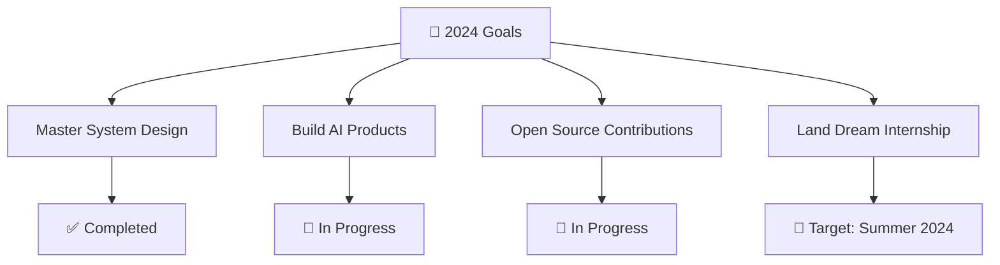

# 🌟 Hello World! I'm Harshita Yadav 

<div align="center">
  
</div>

<p align="center">
  
  
</p>

---

## 🚀 About Me


```python
class HarshitaYadav:
    def __init__(self):
        self.name = "Harshita Yadav"
        self.location = "IIIT Kota, India"
        self.current_focus = ["AI/ML", "Competitive Programming", "Full-Stack Development"]
        self.passion = "Turning ideas into code and code into impact"
        self.learning = ["Deep Learning", "System Design", "Cloud Computing"]
    
    def say_hi(self):
        print("Thanks for dropping by! Let's build something amazing together 🚀")

me = HarshitaYadav()
me.say_hi()
```

🎯 **Currently:** Building AI-powered solutions and mastering competitive programming<br/>
🌱 **Learning:** Advanced ML algorithms, distributed systems, and cloud architecture<br/>
💬 **Ask me about:** Python, JavaScript, Data Science, or anything tech!<br/>
⚡ **Fun fact:** I debug code faster than I debug my life decisions 😄

---

## 🛠️ Tech Arsenal

<div align="center">

### 💻 Languages & Frameworks
<p>
  
</p>

### 🗄️ Databases & Cloud
<p>
  
</p>

### 🔧 Tools & Technologies
<p>
  
</p>

### 📊 Data Science & AI
<p>
  
  
  
  
  
  
  
  
</p>

</div>

---

## 📊 GitHub Analytics

<div align="center">
  
  
</div>

<div align="center">
  
</div>

<div align="center">
  
</div>

---

## 🏆 Competitive Programming Stats

<div align="center">
  
| Platform | Rating/Rank | Problems Solved |
|----------|-------------|-----------------|
|  | Expert Level | 500+ |
|  | 3⭐ | 200+ |
|  | Pupil | 150+ |

</div>

---

## 🎯 2024 Goals & Achievements

<div align="center">



</div>

📈 **This Year's Highlights:**
- 🏅 Solved 500+ coding problems across platforms
- 🚀 Built 15+ full-stack projects
- 📚 Completed 5 ML/AI courses
- 🤝 Contributed to 10+ open source projects

---

## 🌐 Let's Connect & Collaborate!

<div align="center">

[](https://www.linkedin.com/in/harshitayadav504/)
[](https://leetcode.com/hersheyys/)
[](https://www.codechef.com/users/harshitaydv)
[](https://codeforces.com/profile/harshitayadavv211)
[](mailto:harshita@example.com)

</div>

---

<div align="center">
  
### 💭 Favorite Quote
*"The best way to predict the future is to invent it."* - Alan Kay

### 🎵 Coding Soundtrack


### ☕ Support My Work
<a href="https://www.buymeacoffee.com/harshitayadav">
  
</a>

---


**"Code is poetry written in logic"** ✨

</div>
